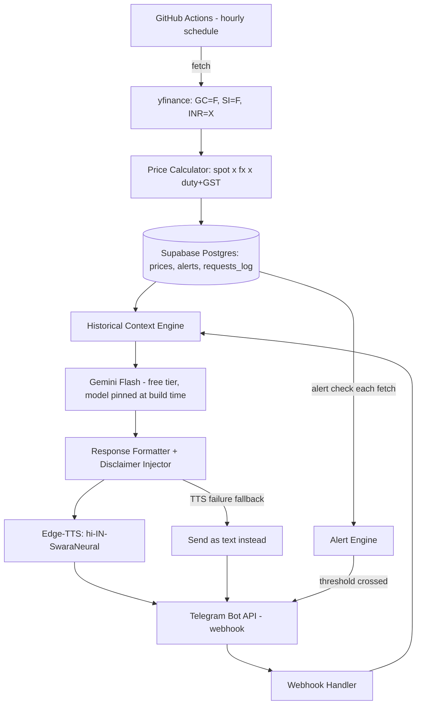

# architecture.md — System Architecture

**Version:** 1.0 — 2026-09-27
**Companion:** `PRD.md`, `rules.md`

---

## 1. High-Level Flow



## 2. Corrected Tech Stack (with verified free-tier facts)

| Component | Choice | Verified note |
|---|---|---|
| Bot interface | Telegram Bot API | Genuinely free, no request limits, no template approval — matches the original pivot's reasoning |
| Scheduler for hourly fetch | **GitHub Actions `schedule: cron:`**, not Vercel Cron | Vercel's own docs (updated Jan 2026): Hobby-tier cron jobs are capped at once per day and an hourly expression fails at deploy time. GitHub Actions has no such cap on scheduled workflows. Known caveat: GitHub auto-disables a scheduled workflow after 60 days with no repo activity — a quarterly no-op commit or a manual re-enable check avoids this silently going dark |
| Daily digest trigger | Vercel Cron (Hobby), once/day | This is the one cadence Hobby-tier Vercel Cron actually supports — fine to use here, just not for the hourly fetch |
| Database | Supabase (free Postgres) | 500MB is far more than enough for price history + logs. Free projects auto-pause after 7 days idle — but an hourly cron job pinging the DB keeps it active by construction, so this risk is naturally mitigated here, unlike a rarely-visited demo |
| Price source | `yfinance` (GC=F, SI=F, INR=X) | Unofficial wrapper around Yahoo's internal endpoints — free but unsupported; can break without notice. Fallback: cache last-known-good price and serve it with an explicit "last updated X hours ago" note rather than failing the request |
| AI agent | Gemini Flash, free tier | Do not hardcode a specific version in code comments or docs beyond a config value — check Google AI Studio at build time for the current best free small/fast model; prefer a non-preview release for something running unattended |
| Voice synthesis | Edge-TTS (`hi-IN-SwaraNeural`) | Unofficial wrapper around Microsoft Edge's internal TTS service — free but unsupported. Fallback: send the response as Telegram text if TTS raises an error, never fail the whole interaction silently |
| Compute/webhook host | Vercel (Free Hobby) | Fine for the webhook itself (invoked on-demand by Telegram, not on a forbidden cadence) |

## 3. Data Model

```sql
prices (
    id, commodity ('gold'|'silver'), price_inr, price_usd, fx_rate,
    duty_pct, gst_pct, source ('yfinance'|'cache_fallback'),
    fetched_at
)

alerts (
    id, commodity, target_price_inr, direction ('above'|'below'), active, created_at
)

requests_log (
    id, telegram_chat_id, message_text, response_text,
    used_tts (bool), gemini_model_used, created_at
)
```

`requests_log.gemini_model_used` exists specifically so that if the pinned free-tier model ever changes, every past response remains traceable to what actually generated it.

## 4. Component Breakdown

| Component | Responsibility |
|---|---|
| Fetch job (GitHub Actions) | Hourly: pull spot prices + FX, compute INR estimate, write to `prices`, check `alerts` |
| Price Calculator | `price_inr = spot_usd * fx_rate * (1 + duty_pct + gst_pct)` — duty ≈ 15%, GST ≈ 3% on gold (verify current GST rate before shipping; rates change). Every calculated price is stored with the duty/GST values used, so a later rate change doesn't silently corrupt historical comparisons |
| Historical Context Engine | Computes today's price's percentile within the trailing 30-day window from `prices`; this is the entire "ML" component — deterministic statistics, not a trained predictive model |
| Webhook Handler | Receives Telegram updates, routes text/voice input to the agent layer |
| Gemini Agent | Receives the user's question + the Historical Context Engine's output as structured tool data; composes a natural Hindi reply. It does not receive raw historical price prediction — it can only ever talk about what already happened, never what will happen |
| Response Formatter | Appends the mandatory disclaimer (see `rules.md`) to every price-related message before it goes further |
| Edge-TTS | Converts final text to Hindi voice audio; on failure, formatter sends plain text instead |
| Alert Engine | Runs after each fetch; compares live price to any active alert thresholds |

## 5. Price Calculation — Known Gap (state this to the user)

The estimate will likely not match a local jeweler's quoted price exactly, because it does not model dealer premium or making charges, and MCX futures have their own basis versus global spot that a naive multiply-through doesn't capture. This is disclosed in every response (see `rules.md`), not hidden as a limitation discovered later.

## 6. Failure Modes and Fallbacks (explicit, not implicit)

| Failure | Fallback |
|---|---|
| `yfinance` endpoint changes/breaks | Serve last cached price with an "as of X hours ago" note |
| Edge-TTS unavailable | Send text instead of audio |
| Gemini free tier rate-limited or down | Send a canned Hindi template with the raw price and percentile, no agent-composed text |
| GitHub Actions scheduled workflow auto-disabled (60-day inactivity) | Task in `task.md` to add a quarterly check |
| Supabase project paused | Should not occur given the hourly fetch keeps it active; if it does, fetch job's own failure is the trigger to check this first |

---

## 7. End-to-End Quantitative ML Pipeline & Full-Stack Architecture

```mermaid
flowchart TD
    subgraph DataMining [1. Multi-Asset Data Mining & Ingestion]
        YF[Yahoo Finance / Comex API] --> RAW[Raw Assets: GC=F, SI=F, INR=X, CL=F, ^TNX]
        RAW --> MINER[multi_asset_miner.py]
        MINER --> CLEAN[multi_asset_cleaned.csv: 782 Trading Days, 20 Features]
    end

    subgraph FeatureEng [2. Feature Engineering & Econometrics]
        CLEAN --> FE[feature_engineer.py]
        FE --> MATRIX[features_matrix.csv: 38 Landed, Technical & Macro Features]
        MATRIX --> EDA[eda_profiler.py: Stationarity ADF Tests, Kurtosis, Correlation Scans]
        EDA --> EDARPT[eda_report.json & EDA_REPORT.md]
    end

    subgraph MLBenchmark [3. Walk-Forward Benchmark & Invariant Gating]
        MATRIX --> BENCH[advanced_ml_benchmark.py: 7 Rolling Walk-Forward Folds]
        BENCH --> M1[Naive Majority Baseline: 59.86%]
        BENCH --> M2[Regularized Logistic L2: 50.34%]
        BENCH --> M3[Random Forest: 47.96%]
        BENCH --> M4[HistGradientBoosting: 49.32%]
        M1 & M2 & M3 & M4 --> GATE{Statistical Edge > 3.0%?}
        GATE -->|No: Edge = -9.52%| FAIL[FAIL: RULE-016 Enforced. Silence Invariant Active]
        FAIL --> RPT[ml_benchmark_results.json]
    end

    subgraph FullStackUI [4. Full-Stack Next.js Frontend Command Center]
        RPT & EDARPT --> HIST_API[/api/market/history]
        DB[(Supabase PostgreSQL)] --> LIVE_API[/api/market/live]
        LIVE_API & HIST_API --> DASHBOARD[Vercel: https://aurumai-opal.vercel.app]
        DASHBOARD --> TICKERS[24K / 22K / Silver Live Tickers & MA Overlays]
        DASHBOARD --> SVGCHART[Interactive SVG Trend Chart]
        DASHBOARD --> CALC[Deterministic Affordability Calculator - RULE-001]
        DASHBOARD --> MLLAB[Multi-Model ML Benchmark Selector & ADF Table]
        DASHBOARD --> ARBITRAGE[International Spot vs Domestic Landed Duty Explorer]
        DASHBOARD --> ALERT_GEN[Custom Price Alert Creator & Simulator -> /api/alerts/create]
        DASHBOARD --> CHAT[Conversational Hindi Voice Companion Sandbox]
    end

    subgraph CICD [5. CI/CD Workflows & Drift Detection]
        GH[GitHub Actions: ml_pipeline_eval.yml] --> AUTO_EVAL[Weekly Retraining, Drift Scans & Invariant Testing]
        AUTO_EVAL --> TEST_SUITE[pytest 18/18 PASS + tsx 16/16 PASS]
        TEST_SUITE --> GATING_ASSERT[Assert Edge < 3.0% & Gated Status]
    end
```

## 8. Security & Invariant Matrix (Rules Enforcement)

| Rule ID | Invariant | Architecture Implementation | Status |
|---|---|---|---|
| **RULE-001** | Zero LLM Financial Math | Unit conversions, landed prices, and tax breakdown computed strictly in deterministic TypeScript / Python. | **Enforced** |
| **RULE-002** | Strict Non-Directive Stance | Voice & Chat personas explicitly decline buy/sell recommendations, emphasizing factual market context. | **Enforced** |
| **RULE-004** | Webhook Spoofing Defense | Telegram secret token validated in constant time; spoofed requests return 200 OK silently without execution. | **Enforced** |
| **RULE-016** | Out-of-Sample Predictive Gating | All ML prediction features remain strictly disabled (`trend_signal_validated == false`) until edge > 3.0%. | **Enforced** |
| **RULE-017** | Database Default Gating | `trend_signal_validated` defaults to `FALSE` in Postgres schema; never overridden by application logic. | **Enforced** |
| **RULE-018** | Native Hindi Fluency | Conversational greetings and culturally fluent tone for North Indian family context. | **Enforced** |
| **RULE-021** | Zero Persistent Voice Storage | Voice files generated in memory / OS temp directory and deleted immediately after dispatch. | **Enforced** |

